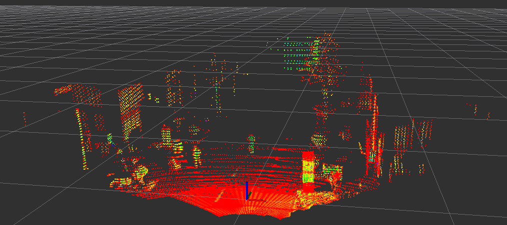
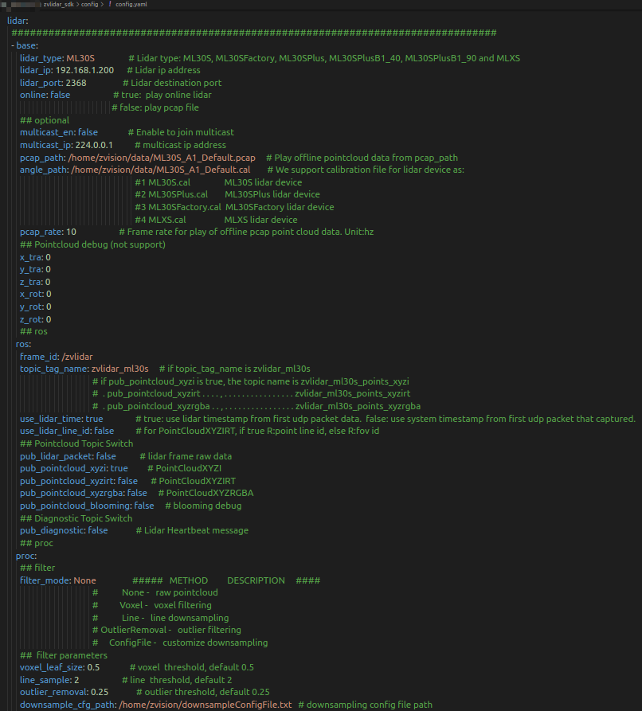

# zvlidar_sdk


#### 1. Prerequisites

(1) Install a ubuntu PC. We suggested Ubuntu 18.04 and ubuntu 20.04. Please do not use virtual machine.
(2) Install ROS/ROS2 full-desktop version. We tried Melodic and Foxy.
(3) Please also install libpcap-dev.

####  2. Install

(1). Copy the whole zvlidar_sdk driver directory into ROS/ROS2 workspace, i.e "~/catkin_ws/src". Please make sure your dir mane has no special characters, '+', '(', ')' etc.

(2). Then to compile the source code and to install it:

```
cd ~/catkin_ws
catkin_make
```

#### 3. Configure PC IP

By default, the ZVISION_LIDAR is configured to **192.168.10.108** as its device IP and **255.255.255.255** as destination IP that it would communicate. The default **LiDAR UDP dst port is 2368**.
So you need configure your PC IP as a static one **192.168.10.10**.

#### 4. Run online lidar or paly offline pcap file

We have provide example run.launch for ROS and run.py for ROS2 under zvlidar_sdk/launch, config.yaml file under zvlidar_sdk/config, you can run the launch or python file to view the point cloud data. For example, if you want to view lidar or pcap pointcloud data:
(1). Open a new terminal and run:

```
cd ~/catkin_ws
source devel/setup.bash
roslaunch zvlidar_sdk run.launch
```

Then we can view the pointcloud via "rviz"



#### 5. About the lidar calibration parameters

Under "**zvlidar_sdk/data**" directory, you can find the lidar calibration parameters files for the exact sensor and pcap file.

#### 6. Config Parameters

We can configure the playback parameters of one or more lidar devices or pcap files in one config.yaml, the support parameters as follow:



For single online lidar or offline pcap file player, we have three parts of parameters setting.

> - base
>
>   The basic playing parameters that lidar ip, port or pcap file path ...
>
> - ros
>
>   We can configure the topic prefix name and whether to publish one or more topics.
>
> - proc
>
>   Whether to filter pointcloud data.

| Param                   | Definition                                                   | Ranges                                                       | Notes                                                        |
| ----------------------- | ------------------------------------------------------------ | ------------------------------------------------------------ | ------------------------------------------------------------ |
| lidar_type              | Type of LiDAR                                                | ML30S/ ML30SFactory/ ML30SPlus/ ML30SPlusB1_40/ML30SPlusB1_90/MLXS | "Player type was not matched with pointcloud type" will be printed in the console if this parameter is set incorrectly. |
| lidar_ip                | IP of LiDAR                                                  | ---                                                          | If this value does not match the device, there will be no pointcloud message and will get "No frames found for lidar ip:port" message in the console. |
| lidar_port              | UDP dst port of LiDAR                                        | ---                                                          | If this value does not match the device, there will be no pointcloud message and will get "No frames found for lidar ip:port" message in the console. |
| online                  | Play mode                                                    | true / false                                                 | true: play online lidar<br/>false: play pcap file            |
| multicast_en            | Join Multicast                                               | true / false                                                 | Enable to join multicast.                                    |
| multicast_ip            | Ip Address                                                   | Valid ip address                                             | Multicast ip address.                                        |
| pcap_path               | Offline pcap file path                                       | ---                                                          | If the program fails to open the file, it will print "OfflinePointCloudProducer GetPointCloudInfo failed" in the console. |
| angle_path              | Path of calibration file                                     | ---                                                          | If the driver fails to open the file,it will print "OfflinePointCloudProducer GetPointCloudInfo failed" in the console.<br />if the value is set to "", the driver will get calibration data online (only works in online mode). |
| pcap_rate               | Frame rate                                                   | default:10                                                   | Frame rate for play of offline pcap point cloud data. Unit:hz. |
| frame_id                | Frame id                                                     | ---                                                          | Manu set Frame id.                                           |
| topic_tag_name          | Topic prefix string                                          | ---                                                          | If topic_tag_name is zvlidar_ml30s,if pub_pointcloud_xyzi is true, the topic name is zvlidar_ml30s_points_xyzi ... |
| use_lidar_time          | Source of message header timestamp                           | true / false                                                 | True: use lidar timestamp from first udp packet data.  False: use system timestamp from first udp packet that captured. |
| use_lidar_line_id       | Publish lines info                                           | true / false                                                 | For PointCloudXYZIRT, if true R:point line id, else R:fov id. |
| pub_lidar_packet        | Publish packets sw                                           | true / false                                                 | Publish lidar frame raw data or not.                         |
| pub_pointcloud_xyzi     | PointCloudXYZI                                               | true / false                                                 | Publish lidar PointCloudXYZI message or not.                 |
| pub_pointcloud_xyzirt   | PointCloudXYZIRT                                             | true / false                                                 | Publish lidar PointCloudXYZIRT message or not.               |
| pub_pointcloud_xyzrgba  | PointCloudXYZRGBA                                            | true / false                                                 | Publish lidar PointCloudXYZRGBA message or not.              |
| pub_pointcloud_blooming | Debug Data                                                   | true / false                                                 | Publish lidar Debug message or not.                          |
| pub_diagnostic          | Lidar Heartbeat message                                      | true / false                                                 | Publish lidar heartbeat message or not.                      |
| filter_mode             | type of filter                                               | None<br />Voxel<br />Line<br/>OutlierRemoval<br/>ConfigFile  | default: none<br />None -   raw pointcloud<br />Voxel -   voxel filtering<br />Line -   line downsampling<br />OutlierRemoval -   outlier filtering<br />ConfigFile -   customize downsampling |
| line_sample             | Parameter of line filter, <br />only take effect when filter_mode is set to **Line** | >=1                                                          | Keep the data of first line every N lines in each field of view, default 2. |
| voxel_leaf_size         | parameter of voxel filter,<br />only take effect when filter_mode is set to **Voxel** | None-zero value                                              | size of voxel grid (unit: m), default 0.5.                   |
| outlier_removal         | parameter of OutlierRemoval filter,<br />only take effect when filter_mode is set to **OutlierRemoval** | positive floating point number                               | *Squared* Euclidean *distance*, default 0.25.                |
| downsample_cfg_path     | path of downsample config file                               | only support for lidar ML30SA1                               | If the driver fails to open the file,it will print "Open downsample file failed" in the console.<br />if the value is set to "", the driver will not downsampling the pointcloud. |
